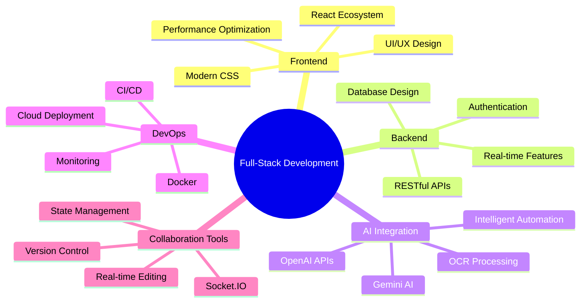

# 👋 Hello, I'm **Vikram Khandelwal** 
### 💻 Software Developer | 🚀 Full-Stack Engineer | ⚡ Innovation Enthusiast
portfolio - https://vikramkhandelwal07.vercel.app/

<div align="center" >
  
  
  
</div>

---

## 🧠 **About Me**

> *"Code is like humor. When you have to explain it, it's bad."* - Cory House

I'm a passionate **Full-Stack Software Developer** with expertise in modern web technologies and a knack for building scalable, user-centric applications. Currently pursuing my B.Tech at Nirma University with a CGPA of 8.58, I specialize in the MERN stack and have hands-on experience with cutting-edge technologies like AI integration, real-time collaboration, and cloud platforms.

**What drives me:**
- 🔧 **Problem Solver**: Love tackling complex challenges with elegant, efficient solutions
- 🚀 **Innovation Enthusiast**: Always exploring emerging technologies and development practices
- 👥 **Collaborative Builder**: Passionate about creating tools that enhance developer productivity
- 🎯 **Impact Creator**: Focused on building applications that solve real-world problems

---

## 🎯 **Current Focus**

```javascript
const currentStatus = {
    education: "B.Tech at Nirma University (CGPA: 8.58)",
    Internship: "Siemens Energy - Operations Data & Automation",
    focus: ["Full-Stack Development", "AI Integration", "Real-time Applications"],
    learning: ["Advanced Next.js", "Cloud Architecture", "System Design"],
    interests: ["EdTech", "FinTech", "Developer Tools"],
    collaboration: "Open to exciting projects and internships"
}
```

---

## 🛠️ **Technical Arsenal**

### **Languages & Core Technologies**
<div align="left">
  
  
  
</div>

### **Frontend Development**
<div align="left">
  
  
  
  
  
  
</div>

### **Backend Development**
<div align="left">
  
  
  
  
</div>

### **Databases & ORMs**
<div align="left">
  
  
  
  
  
</div>

### **AI & Modern Tools**
<div align="left">
  
  
  
  
</div>

### **Development Tools & Platforms**
<div align="left">
  
  
  
  
  
</div>

---

## 📊 **GitHub Analytics**

<div align="center">
  
  
  
  
  
</div>

<div align="center">
  
  
  
</div>

---

## 🚀 **Featured Projects**

### 🎨 **AsyncUI: Collaborative UI Component Library**
*Real-time collaborative development platform*

**🔗 [Live Demo](https://async-ui.vercel.app/) | [GitHub](https://github.com/vikramkhandelwal07)**

**Tech Stack:** MERN, Socket.IO, Framer Motion, Tailwind CSS

- 🎯 **17+ Interactive Components**: Built a comprehensive UI library with customizable, reusable components
- ⚡ **Real-time Collaboration**: Implemented live cursors, multi-user editing, and interactive pixel grid
- 📈 **35% Faster Development**: Reduced design iteration time through live preview and instant customization
- 🏗️ **Scalable Architecture**: Modular system with comprehensive documentation and seamless integration

---

### 📚 **Brainn: Modern Ed-Tech Platform**
*Comprehensive learning management system*

**🔗 [Live Demo](https://brainn-platform.vercel.app/) | [GitHub](https://github.com/vikramkhandelwal07)**

**Tech Stack:** React, Redux, Node.js, MongoDB, JWT, Cloudinary

- 📊 **40% Higher Engagement**: Built structured courses with hands-on projects and real-time tracking
- 🛠️ **Intuitive Course Builder**: Streamlined instructor interface reducing setup time by 50%
- 🔐 **Secure Authentication**: Implemented robust user management with email verification and session handling
- 📈 **Analytics Dashboard**: Real-time enrollment tracking and progress monitoring

---

### 💰 **TrackIt: AI-Powered Finance Management**
*Smart personal finance tracker with OCR integration*

**🔗 [Live Demo](https://trackit-finance.vercel.app/) | [GitHub](https://github.com/vikramkhandelwal07)**

**Tech Stack:** Next.js, Supabase, Prisma, Gemini AI, PostgreSQL, Clerk

- 🤖 **AI-Powered Insights**: Integrated Gemini AI for intelligent financial analysis and recommendations
- 📱 **95% OCR Accuracy**: Automated receipt scanning with advanced text recognition
- 📊 **Automated Reports**: Weekly/monthly financial summaries reducing manual effort by 40%
- 🛡️ **Enterprise Security**: Implemented ArcJet security with comprehensive user activity analytics

---

## 💼 **Professional Experience**

### **Siemens Energy** - *Operations Data & Automation Intern*
**May 2025 – July 2025 | Ahmedabad, India**

- 🏭 **Industrial Automation**: Gained hands-on experience with automation tools and data-driven operations
- 📊 **Data Analysis**: Assisted with production reporting using internal ERP systems to identify process inefficiencies  
- 🔧 **Technical Exposure**: Worked with Ansys 3D modeling, CNC programming, and automated testing systems
- ⚙️ **Manufacturing Insight**: Contributed to high-performance compressor packaging operations

---

## 🏆 **Achievements & Recognition**

<div align="center">

| 🏅 **Award** | 🏢 **Organization** | 📅 **Year** | 🎯 **Achievement** |
|:-------------|:-------------------|:-------------|:-------------------|
| 🇮🇳 **Top 100 India** | College Youth Ideathon | 2025 | Among 10,000+ teams nationwide |
| 🎨 **Best UI/UX Design** | Hack for India | 2023 | 1st place among 200 teams |
| 💰 **INSPIRE Scholarship** | Gujarat Board | 2022 | ₹4,00,000 for top 1% performance |
| 🥈 **2nd Rank** | Kshitij Project Exhibition | 2024 | Project Exhibition & Consulting |
| 🎓 **Scholar Certificate** | Nirma University | 2022-2025 | 5x recipient for academic excellence |

</div>

---

## 💡 **Technical Specializations**



---

## 🎓 **Education**

**Bachelor of Technology** | *Institute of Technology, Nirma University*
- 📍 Ahmedabad, Gujarat
- 🎯 CGPA: 8.58/10.0
- 🏆 5x Certificate of Scholar for Academic Excellence

---

## 🌐 **Let's Connect & Collaborate**

<div align="center">

[](https://vikramkhandelwal07.vercel.app/)
[](https://linkedin.com/in/vikram-khandelwal/)
[](https://github.com/vikramkhandelwal07)
[](mailto:vikramkhandelwal07@gmail.com)
[](tel:+919316206584)

</div>

---

## 💬 **Let's Build Something Amazing!**

I'm always excited to discuss:
- 🚀 **Full-Stack Development**: Modern web technologies, scalable architectures, and best practices
- 🤖 **AI Integration**: Building intelligent applications with cutting-edge AI APIs
- 🎨 **UI/UX Innovation**: Creating intuitive, engaging user experiences
- 🔧 **Developer Tools**: Building productivity-enhancing applications and workflows  
- 🤝 **Collaboration**: Open source contributions, hackathons, and innovative projects

---

<div align="center">
  
### 📫 **Ready to build the future together? Let's connect!**

*"The best way to predict the future is to create it."* - Peter Drucker


</div>

---

<div align="center">
  
</div>
